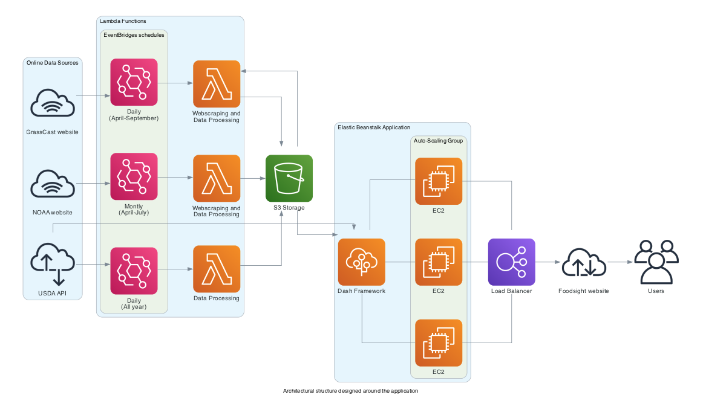

# FoodSight

## Overview

This repository hosts the code for a Python Dash application, FoodSight, aimed at providing non-experts in data analysis with straightforward access to farming and ranching data. The application focuses on visualizing and interacting with [GrassCast](https://grasscast.unl.edu/) Productivity Forecast data, simplifying their access, visualization, and interpretation. It also incorporates basic spatial analysis tools, offering insights into the expected productivity for each growing season. Additionally, FoodSight correlates GrassCast scenarios with the [NOAA Climate Outlooks](https://www.cpc.ncep.noaa.gov/products/predictions/long_range/interactive/index.php) from the Climate Prediction Center.

The application also incorporates sections dedicated to ranching market data, sourced from the My Market News USDA API. This integration allows users to directly access and analyze market data and trends for Cattle and Hay commodities across all US auctions. Furthermore, FoodSight includes a decision-making tool during drought events developed by Colorado State University.

- You can access the tool here: [FoodSight Application](https://app.foodsight.org/). 
- For additional information on the data processing pipeline, please consult `foodsight_notebook.ipynb` or visit [FoodSight Project Notebook](https://pcarbomestre.github.io/blog-posts/FoodSight-notebook/foodsight_notebook.html).

## Dash Framework

Dash facilitates the building of data apps in Python, streamlining the development and deployment in a secure, scalable environment. Its capacity to manage complex data visualizations and real-time updates made it the ideal choice for the FoodSight project.

The application's code and dependencies are stored in the "foodsight-app" folder of this repository. While the interactive display of ANPP forecast data is the core element, the multipage application also includes two additional main pages: one for market data and another for a decision-making tool.

 

## Deployment

FoodSight's deployment utilizes AWS services, including ElasticBeanstalk, Lambda, S3, and EC2 instances. The backend code automates data retrieval through API integrations and web scraping. These services manage data storage, updates, and processing for display in an interactive application, accessible at [https://app.foodsight.org/](https://app.foodsight.org/). Below is a diagram depicting the architectural structure of the application, whcih ensures the provision of updated and interactive information.

 

## Roadmap

As a proof of concept, FoodSight aspires to evolve into a comprehensive platform dedicated to integrating essential ranching data. While the GrassCast Forecast remains a foundational feature, we are exploring the inclusion of other critical datasets to benefit ranchers in their daily activities. Despite the abundance of online data resources, the full potential of ranchin data remains largely untapped due to accessibility challenges. FoodSight aims to bridge this gap.

## Acknowledgments

This project is greatly indebted to the GrassCast Productivity Forecast, a joint venture involving the University of Nebraska–Lincoln, USDA, NDMC, Colorado State University, and the University of Arizona. We also acknowledge the invaluable contributions of tools created by the USDA, such as My Market News API, which greatly enhanced the market section of our project. Lastly, we extend our gratitude to Jeffrey E. Tranel, Rod Sharp, & John Deering from the Department of Agriculture and Business Management at Colorado State University for their 'Strategies for Beef Cattle Herds During Times of Drought' tool, which has been instrumental in developing the decision-tool section.
