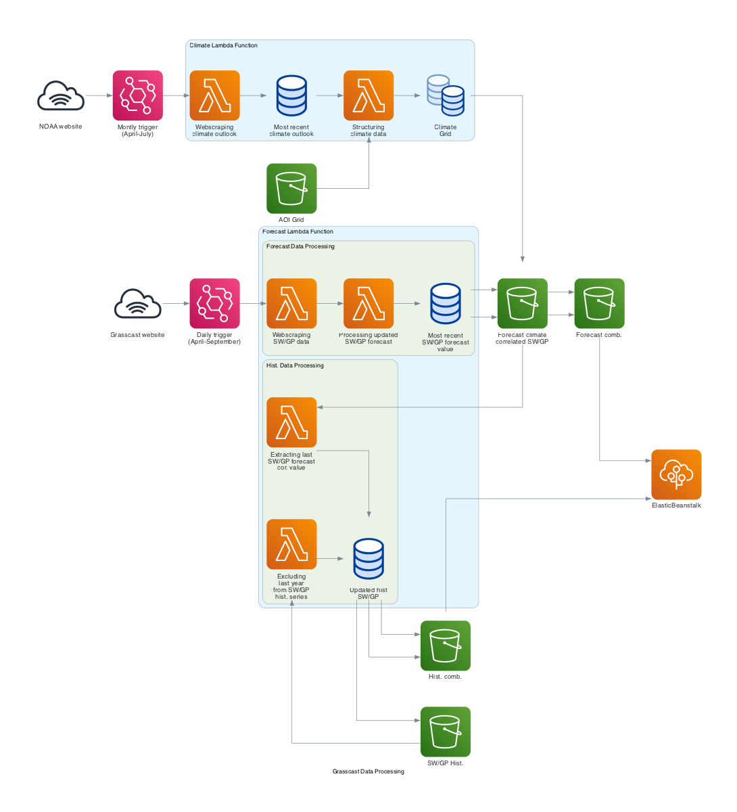

# Forecast Data Updates

The diagram below summarizes the processes associated with data access and web scraping from NOAA and GrassCast websites, as well as the transformations conducted to generate the final datasets that feed into the app. Two Lambda Functions have been implemented for this purpose. The processes associated with the Forecast Lambda Function, as depicted in the diagram, are run independently for the GP and SW regions' datasets. These processes include some minor differences, as described in the Data section.

Due to the considerable size of the dependencies involved, both functions have been packaged as Docker images. The deployment was carried out using AWS CDK and CLI, and you can access the files and folder structure in the "clim-forecast_updates-aws-lambda-docker" folder within the repository.

 

## Climate Lambda Function

This function accesses NOAA's long-range precipitation outlook records, which are available at [https://ftp.cpc.ncep.noaa.gov/GIS/us_tempprcpfcst/](https://ftp.cpc.ncep.noaa.gov/GIS/us_tempprcpfcst/), and stores them in S3 storage services as a shapefile. It then reads the GrassCast grid and joins the outlooks' attributes by finding the largest overlap within each cell of the grid. The resulting file contains a dataset that includes each cell's ID, its association with a climate scenario, and the associated probability. This dataset is further used in the Forecast Lambda Function.

## Forecast Lambda Function

As for the climate function, the lambda function responsible for updating GrassCast values shares much of the processing code implemented for generating the original datasets described in the Data section. This section provides the code required to web scrape data from GrassCast, retrieve the latest forecast values, correlate them with climate outlooks, and determine the expected forecast scenario. Additionally, the updated forecast dataset, ready for display, is used to update the historical series dataset by incorporating the most recent forecasted value and combining information from both regions (SW and GP) into a single dataset.
